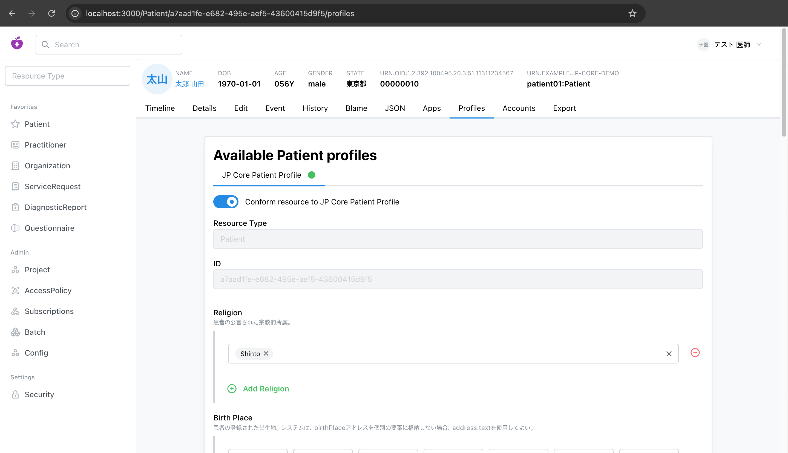

# FHIR JP Core Profile on Medplum

> [!NOTE]
> **言語を選択：** [English](README.md) | 日本語



Medplum 上で FHIR [JP Core](https://jpfhir.jp/fhir/core/) プロファイルを設定するためのスクリプトとアーティファクト。患者データの例も含まれています。

これらのスクリプトは、以下の処理を行います：

- 「JP Core 実装ガイド」とその依存関係を FHIR パッケージとしてダウンロードします。
- JP Core の準拠リソース（StructureDefinition、ValueSet、CodeSystem、および用語集）を Medplum プロジェクトに読み込みます。
- プロジェクトに患者の例を追加します。

Medplum SDK **v5.1.23** 向けに構築されています。

## はじめに

1. [Medplum の説明](https://www.medplum.com/docs/contributing/local-dev-setup)に従って、ローカル開発サーバーを起動してください（API は `http://localhost:8103`、Web UI は `http://localhost:3000`）。

2. Medplum の Web UI から、新しいユーザーとプロジェクトを登録します。

3. 次に、認証情報を取得し、**Client Application をプロジェクトの Admin に設定**する必要があります：

   1. Project → Clients → ... Default Client の順に選択し、ステップ 4 のために下部に表示されている *ID* と *Secret* をコピーしてください。
   2. ページの上部までスクロールして、「Go to ProjectMembership」→ Edit →下部の Admin にチェックを入れる→ Update

4. それらの認証情報を `.env.dev` に追加してください（まだ存在しない場合は、`.env.dev.example` をコピーしてください）：

   ```bash
   # .env.dev
   MEDPLUM_BASE_URL=http://localhost:8103
   MEDPLUM_CLIENT_ID=<your client id>
   MEDPLUM_CLIENT_SECRET=<your client secret>
   ```

5. その環境を有効にします。これにより `.env.dev` → `.env` にコピーされ、スクリプトはこのファイルを読み込みます：

   ```bash
   bash ./scripts/set_env.bash dev
   ```

6. 依存関係をインストールし、スクリプトを順番に実行してください：

   ```bash
   npm install
   npm run fetch               # download the JP Core FHIR packages into data/jp-core/
   npm run deploy              # load profiles, value sets + terminology
   npm run deploy-terminology  # load the large drug/disease code systems
   npm run deploy-examples     # seed the 3 demo patients
   ```

7. `http://localhost:3000` で Medplum アプリの UI を開き、読み込まれた JP Core プロファイルとデモ患者を確認してください。

この文書の残りの部分では、各手順について詳しく説明します。

## 患者の例

| | **Patient 01** | **Patient 02** | **Patient 03** |
| --- | --- | --- | --- |
| Bundle | `example-patient01-bundle.json` | `example-patient02-bundle.json` | `example-patient03-bundle.json` |
| 氏名（漢字） | 山田 太郎 | 佐藤 花子 | 鈴木 健一 |
| 氏名（カナ） | ヤマダ タロウ | サトウ ハナコ | スズキ ケンイチ |
| Gender / DOB | male / 1970-01-01 | female / 1985-07-15 | male / 1958-11-30 |
| 住所 | 東京都新宿区 (160-0023) | 大阪府大阪市北区 (530-0001) | 愛知県名古屋市中区 (460-0008) |
| 宗教（extension） | Shinto | Christian | — （なし） |
| 患者識別子 | `…11311234567 \| 00000010` | `…11311234567 \| 00000021` | `…11311234567 \| 00000032` |

臨床コードは、**インポートされた JP コードシステムから取得された実際の値**であり、すべての漢字氏名には対応するカタカナの読みがあります。

## パッケージ

`fetch.ts` は JP Core IG を解決し、その `dependencies` を推移的にたどることで、[data/jp-core/](data/jp-core/) 配下に 5 つの展開済み FHIR パッケージを生成します：

| パッケージ                           | 役割                     | デプロイ対象 | 主な内容                                                                                    |
| ----------------------------------- | ------------------------ | :-------: | ----------------------------------------------------------------------------------------- |
| `hl7.fhir.r4.core-4.0.1`            | FHIR R4 の基本仕様        |     ✗     | 4,580 ファイル                                                                             |
| `hl7.terminology.r4-7.0.0`          | 基本用語集                |     ✗     | 基本の CodeSystem / ValueSet                                                                |
| `hl7.fhir.uv.extensions.r4-5.2.0`   | 基本の extension          |     ✗     | 基本の extension 定義                                                                       |
| `jpfhir-terminology.r4-1.4.0`       | JP 用語集                 |     ✓     | 106 CodeSystem、97 ValueSet                                                                |
| `jpfhir.jp.core-1.2.0`              | **JP Core IG**（ルート）  |     ✓     | 111 StructureDefinition、24 ValueSet、17 CodeSystem、8 SearchParameter、45 NamingSystem、2 CapabilityStatement |

3 つの上流の基本パッケージは**デプロイされません**。Medplum には FHIR R4 の基本定義と共通の用語集が組み込まれているため、4,500 以上の基本ファイルを再アップロードするのは無駄であり、競合のリスクもあります。デフォルトでは、JP 固有の 2 つのパッケージのみが読み込まれます。

## 前提条件

- Node（リポジトリのルートにある [.nvmrc](.nvmrc) を参照）
- 依存関係をインストールします：

  ```bash
  cd artifacts
  npm install
  ```

## プロジェクトのスコープ（重要）

`deploy*` スクリプトが作成するものはすべて、**認証に使用したクライアント認証情報に関連付けられた単一の Medplum プロジェクト**にスコープされます。これらは他のプロジェクトや新しいプロジェクトとは共有され**ません**。

- 書き込み時、Medplum は各リソースに `meta.project` = クライアントのプロジェクトを付与し、読み取りはすべてそのプロジェクト（およびリンクされたプロジェクト）に限定されます。したがって、JP Core の StructureDefinition、ValueSet、CodeSystem（およびデモ患者）は、そのプロジェクト内にのみ存在します。
- 例外となるのは **base FHIR** で、Medplum はこれを内部の「合成 R4 プロジェクト」を通じてすべてのプロジェクトと共有しています。そのため、基本のリソースタイプはどこでも利用できますが、JP Core は利用できません。また、`deploy.ts` が JP Core の参照する基本の *extension* をプロジェクトに読み込むのも、このためです。まったく新しいプロジェクトは、これらの基本の組み込みリソースのみを備えて開始されます。
- `CodeSystem/$import` を通じて読み込まれた用語集も同様に、その CodeSystem リソースを所有するプロジェクトからのみアクセス可能です。

JP Core を**複数の**プロジェクトで利用可能にするには、次のいずれかの方法があります：

1. **各プロジェクトごとにスクリプトを 1 回実行する** — その際、各プロジェクト固有のクライアント認証情報を使用します（シンプルで、完全に分離されます）。あるいは、
2. **共有プロジェクトに一度デプロイし、他のプロジェクトをそこにリンクする** — Medplum の [`Project.link`](https://www.medplum.com/docs/access/projects) を使用します。利用側のプロジェクトは、リンクされたプロジェクトからリソースを継承します。これは `Project.exportedResourceType` によって制御されます（`StructureDefinition` / `ValueSet` / `CodeSystem` を指定するか、すべてをエクスポートする場合は空のままにします）。`Project.link` / `exportedResourceType` の編集は、Project リソースに対する管理者操作です。

## `fetch.ts` — パッケージのダウンロード

まずこれを実行してください。[data/jp-core/](data/jp-core/) にある取得済みのパッケージは、サイズが大きいため git に**コミットされていません**。そのため、デプロイする前にダウンロードする必要があります。

```bash
npm run fetch        # → tsx src/fetch.ts ./data
```

処理内容：

- ルートパッケージ `jpfhir.jp.core#1.2.0` および `hl7.fhir.r4.core#4.0.1` から開始し、各パッケージの `dependencies` を幅優先でたどります。
- まず既知の JP URL から各 `.tgz` をダウンロードし、それができない場合は FHIR パッケージレジストリ（`packages2.fhir.org`、`packages.fhir.org`、`packages.simplifier.net`）にフォールバックします。ダウンロードされたファイルは、受け入れられる前に検証されます（`package/package.json` が含まれている必要があります）。
- 各パッケージを `data/jp-core/<name>-<version>/` に展開し、中間ファイルである `.tgz` を削除します。

再実行は冪等です。すでに展開済みのパッケージはスキップされます。

## `deploy.ts` — Medplum への準拠リソースの読み込み

<https://www.medplum.com/docs/fhir-datastore/profiles> に記載されているパターンを実装しています。つまり、`meta.profile` を通じて参照するプロファイルの `StructureDefinition`（およびそれがバインドする用語集）は、プロジェクト内に存在している必要があります。

```bash
MEDPLUM_BASE_URL=https://api.medplum.com/ \
MEDPLUM_CLIENT_ID=... \
MEDPLUM_CLIENT_SECRET=... \
  npm run deploy               # → tsx src/deploy.ts ./data

# Preview counts without uploading:
npx tsx src/deploy.ts ./data --dry-run
```

環境変数（`dotenv` 経由で読み込むか、手動で export してください）：

| 変数                    | 説明                                          |
| ---------------------- | -------------------------------------------- |
| `MEDPLUM_BASE_URL`     | Medplum サーバーのベース URL                   |
| `MEDPLUM_CLIENT_ID`    | Client application ID（クライアント認証情報）   |
| `MEDPLUM_CLIENT_SECRET`| Client application secret                     |

`bash ./scripts/set_env.bash <dev|prod>` を実行すると、`.env.<env>` → `.env` にコピーされます（`dotenv` によって読み込まれます）。そのため、これらの変数を手動で export する必要はありません — [はじめに](#はじめに)を参照してください。

### 仕組み

1. **Auth** — `medplum.startClientLogin(clientId, clientSecret)`（クライアント認証情報フロー）。
2. **Collect** — デプロイ対象の各パッケージから最上位の `package/*.json` ファイルを読み込み（examples、`openapi/`、`xml/` サブディレクトリは無視されます）、以下に挙げる準拠リソースタイプのみを保持します。
3. **Filter** — 2 種類のアーティファクトは初期段階で除外され、アップロードされるのではなくスキップとして報告されます：
   - **基本用語集** — 正規の `url` が基本ルート（`terminology.hl7.org`、`loinc.org`、`snomed.info`、`urn:iso:`、`urn:ietf:`、…）配下にある CodeSystem。Medplum はこれらを組み込みとして提供しており、上書きを禁止しています（HTTP 403）。
   - **サイズ超過の CodeSystem** — シリアライズ後のサイズが `MAX_UPLOAD_BYTES`（4 MB）を超えるもの。Medplum は概念を Postgres にインポートしますが、大規模なコードシステムではバインドパラメータの上限を超えてしまいます。
4. **Sanitize** — 必須の `label` が欠落している `ElementDefinition.example` のエントリを削除します（これは公開済みの一部の JP Core プロファイル（例：`JP_Consent`）に見られる不具合で、Medplum はそのままでは拒否します）。example は規範的ではないため、インスタンスの検証方法には影響しません。
5. **Resolve base extensions** — JP プロファイルが参照する基本 extension の StructureDefinition を取り込み、それらの参照からバージョン情報を削除します（[基本 extension と Medplum UI](#基本-extension-と-medplum-ui)を参照）。
6. **Order** — 依存関係の順序に従ってタイプごとにアップロードするため、ValueSet のバインディングや StructureDefinition の参照は、リソースが取り込まれると同時に解決されます：

   ```
   CodeSystem → ValueSet → StructureDefinition → SearchParameter → NamingSystem → CapabilityStatement
   ```

7. **冪等なアップロード** — 各リソースは、正規の `url` をキーとする FHIR の**条件付き更新**として、バッチ `Bundle`（`medplum.executeBatch`）内で送信されます（`PUT StructureDefinition?url=...`。R4 の `NamingSystem` のように `url` を持たないリソースは `?name=` にフォールバックします）。サーバー管理の `id` および `meta` は削除されるため、正規 URL が唯一の識別キーとなり、バージョン履歴に矛盾が生じることはありません。再実行時には、リソースを複製するのではなくその場で更新します。
8. **バッチ処理と耐障害性** — エントリは、エントリ数（`BATCH_SIZE`）とシリアライズ後のバイト数（`MAX_BATCH_BYTES`）の両方で制限されたバッチにグループ化されるため、バッチがサーバーのリクエストサイズ上限を超えることはありません。リクエストレベルでバッチ全体が拒否された場合（例：HTTP 413）、そのバッチは半分に分割され、単一エントリになるまで再試行されます。そのため、1 つのサイズ超過リソースが実行全体を中止させることはありません。
9. **レポート** — エントリごとのステータスは、deployed / skipped（base）/ skipped（protected、403）/ skipped（too large）/ failed に分類されます。既知のサーバー制限はスキップとして報告され、真に予期せぬエラーのみが failed としてカウントされます。プロセスが非ゼロで終了するのは `failed > 0` の場合のみです。

### 基本 extension と Medplum UI

JP Core プロファイルは、`type.profile` 内でバージョンが固定された**正規 URL** を持つ、いくつかの基本 extension を参照しています。例えば `http://hl7.org/fhir/StructureDefinition/patient-religion|4.0.1` などです。Medplum アプリでこのようなリソースを編集する際、以下の 2 つの問題が発生します：

- それらの基本 extension の StructureDefinition はプロジェクトに含まれていません（基本の `hl7.fhir.r4.core` / `hl7.fhir.uv.extensions.r4` パッケージはデプロイしないため）。
- Medplum の React `ExtensionInput` は `StructureDefinition?url=<canonical>` で extension を検索しますが、**Medplum の `url` 検索は `|version` サフィックスに一致しません**（バージョン付き正規 URL を処理できるのは `$expand` のみです）。そのため検索結果は何も返されず、フィールドは「loading…」の状態で止まってしまいます。

`deploy.ts` はこの両方を修正します。プロファイルの `type.profile` の値をスキャンし、バージョンが固定された各 `hl7.org` extension について、**その extension の StructureDefinition を基本パッケージから読み込み**（固定されたバージョンで — `hl7.fhir.r4.core` からは `4.0.1`、`hl7.fhir.uv.extensions.r4` からは `5.2.0`）、参照から **`|version` を削除**して、UI がバージョンなしの正規 URL で解決できるようにします。JP Core 1.2.0 では、これにより 5 つの extension（`patient-religion`、`patient-birthPlace`、`encounter-associatedEncounter`、`bodySite`、`iso21090-EN-representation`）が追加されます。

> **ValueSet** にバインドされたコード化フィールドや列挙型フィールドは影響を受けません。Medplum クライアントはバインディングを `$expand` で展開し、これはバージョン付き正規 URL を_解決できる_ためです — ただし ValueSet が存在している場合に限ります（基本の ValueSet は Medplum に同梱されており、JP のものはデプロイされます）。

> **再デプロイ後は、Medplum アプリをハードリフレッシュしてください。** クライアントはプロファイルスキーマ（失敗した検索結果を含む）をセッションごとにメモリにキャッシュするため、すでに開いているタブでは、再読み込みするまで新しく読み込まれた extension が反映されません。

### ソースアーティファクトへの変更

透明性のために：Medplum でアーティファクトを読み込み・表示できるようにするため、`deploy.ts` はすべてのプロファイルを公開されたままバイト単位でアップロードするわけでは**ありません**。アップロード前に、メモリ上の StructureDefinition に対して、ログに記録される 2 つの限定的な編集を加えます（ディスク上のファイルは一切変更されません）：

| 編集 | 理由 | 影響 |
| ---- | --- | ------ |
| 必須の `label` が欠落している `ElementDefinition.example` のエントリを削除する | 公開済みの不具合（例：`JP_Consent`）で、Medplum が "Missing required property" として拒否する | なし — example は規範的ではないドキュメント |
| 基本 extension の `type.profile` 参照から `\|version` を削除する | Medplum の `url` 検索はバージョン付き正規 URL に一致できないため、UI が extension を解決できない | 参照はバージョンに依存しなくなり、読み込まれた（単一の）extension に解決される |

いずれも実行結果に報告されます（`removed N malformed example(s)`、`added N … base extension(s); de-versioned their type.profile refs`）。このような不具合に対して回避的な編集を行うよりもツールに明確にエラーを出させたい場合は、collect フェーズから `sanitizeExamples` / `resolveBaseExtensions` を削除してください。

### 設定

[src/deploy.ts](src/deploy.ts) の先頭にあるノブ：

- `PACKAGES_TO_DEPLOY` — 読み込む展開済みパッケージ（デフォルトでは JP 固有の 2 つのパッケージ）。ターゲットサーバーに JP Core が参照する基本 extension や用語集が欠けている場合は、ここに上流の基本パッケージを追加してください。
- `RESOURCE_TYPE_ORDER` — 読み込まれるリソースタイプと、その読み込み順序。
- `BASE_TERMINOLOGY_PREFIXES` — Medplum の組み込みとして扱われ、スキップされる正規 URL のルート。
- `BATCH_SIZE`（50）/ `MAX_BATCH_BYTES`（4 MB）— バッチサイズの上限。
- `MAX_UPLOAD_BYTES`（4 MB）— 単一リソースの上限。これを超える CodeSystem は、インラインインポートには大きすぎるとしてスキップされます。
- `BASE_EXTENSION_SOURCES` — 参照されている基本 extension の StructureDefinition を提供する基本パッケージ（バージョンごとに分類）。

### 大規模な CodeSystem

一部の大規模な JP 用語集 CodeSystem（178k 概念を含む `jami.jp/CodeSystem/MedicationUsage`、`mhlw/masterB-disease`、MEDIS HOT/YJ コードマスターなどの医薬品・疾患マスター）には、数万のインライン概念が含まれています。Medplum のインライン概念インポートは、これらに対して Postgres のバインドパラメータ上限を超過するため、`deploy.ts` はそれらを "too large for inline import" として報告し、スキップします。以下の [`deploy-terminology.ts`](#deploy-terminologyts--大規模な-codesystem-の読み込み) を使用して、別途読み込んでください。

### 期待される結果

Medplum サーバーに対してデフォルトのパッケージセットをデプロイすると、次のような結果になります：

| 結果                             | 件数  |
| ------------------------------- | ----: |
| **Deployed**                    | ~395  |
| Skipped — 基本用語集              |    11 |
| Skipped — サイズ超過（`$import`） |     9 |
| Failed                          |     0 |

タイプ別のデプロイ内訳（402 件の試行のうち、7 件の中規模 CodeSystem が実行時に Postgres のパラメータ上限に抵触し、サイズ超過スキップとして再分類されます）：

| タイプ               | Deployed |
| ------------------- | -------: |
| CodeSystem          |      103 |
| ValueSet            |      121 |
| StructureDefinition |      116 |
| SearchParameter     |        8 |
| NamingSystem        |       45 |
| CapabilityStatement |        2 |
| **合計**             |  **395** |

116 個の StructureDefinition は、111 個の JP プロファイル／extension に加え、参照されている 5 つの基本 extension で構成されています（[基本 extension と Medplum UI](#基本-extension-と-medplum-ui)を参照）。

## `deploy-terminology.ts` — 大規模な CodeSystem の読み込み

`deploy.ts` がインラインで読み込めない大規模な用語集に対応する補助スクリプトです。[`CodeSystem/$import`](https://www.medplum.com/docs/api/fhir/operations/codesystem-import) 操作を使用しており、概念をリソース本体に埋め込むのではなく、Medplum の用語テーブルにストリーム形式で取り込みます。

```bash
MEDPLUM_BASE_URL=https://api.medplum.com/ \
MEDPLUM_CLIENT_ID=... \
MEDPLUM_CLIENT_SECRET=... \
  npm run deploy-terminology        # → tsx src/deploy-terminology.ts ./data

npx tsx src/deploy-terminology.ts ./data --dry-run   # list targets, import nothing
```

> **権限：** `$import` の実行には **Project Admin** が必要です。使用するクライアント認証情報には、対象プロジェクトへの管理者アクセス権が必要です。

`deploy.ts` の**後に**実行してください（CodeSystem の ValueSet とプロファイルが先に配置されている必要があります）。`deploy.ts` と同じ環境変数を使用します。

**冪等です。** `$import` は `(system, code)` に基づいて概念を upsert するため、再実行しても一度実行した場合と同じ状態になります。つまり、既存のコードをインポートしても、重複が作成されるのではなくその場で更新されます。（検証済み：display を変更したコードを再インポートすると既存の単一のコードが更新され、元のコードを再インポートすると復元されます。）メタデータの処理でも同様に、`url` をキーとする `upsertResource` が使用されます。

### 仕組み

1. **Select** — 基本以外のすべての CodeSystem を読み込み、`MIN_IMPORT_CONCEPTS`（10,000）以上の概念を持つもの、つまり `deploy.ts` がスキップするものを保持します。（インラインインポートの上限はおよそ 15〜18k 概念です。しきい値はそれより低く設定されており、見落としがないようにしています。また `$import` は冪等であるため、インラインで読み込まれるシステムとの重複があっても問題ありません。）
2. **メタデータの upsert** — 各システムに対して軽量な CodeSystem リソースを書き込みます（インラインの概念は削除され、`content: "not-present"` となります）。これにより、バインディング用にリソースが存在するようになり、その後の更新でインポート済みの概念が消去されることもなくなります。
3. **Flatten** — 各（階層構造を持つ可能性のある）概念ツリーを、`{ code, display }` のフラットなリストに変換します。階層構造は保持されません。これらのマスターはフラットな値セットとして利用され、`$expand` / `$validate-code` にはそれで十分です。
4. **Import** — 概念を `IMPORT_CHUNK`（2,000）単位のチャンクに分けて `CodeSystem/$import` に送信します。これは Postgres のバインドパラメータ上限を十分に下回っています。拒否されたチャンクは分割され、単一の概念になるまで再試行されるため、1 つの不正なコードがシステム全体を中断させることはありません。

### 設定

[src/deploy-terminology.ts](src/deploy-terminology.ts) の先頭にあるノブ：

- `MIN_IMPORT_CONCEPTS`（10,000）— ここで処理する概念数の下限。`0` に設定すると、基本以外のすべての CodeSystem を `$import` 経由でインポートします。
- `IMPORT_CHUNK`（2,000）— `$import` リクエストごとの概念数。

### 期待される結果

デフォルトのパッケージセットに対しては、合計約 451k 概念を含む 11 のコードシステムをインポートします（以下は大きい順。スクリプトの実行順は小さい順です）：

| CodeSystem                                              | 概念数    |
| ------------------------------------------------------- | -------: |
| `jami.jp/CodeSystem/MedicationUsage`                    |  178,214 |
| `medis.or.jp/CodeSystem/master-HOT13`                   |   63,058 |
| `medis.or.jp/CodeSystem/master-HOT9`                    |   33,533 |
| `medis.or.jp/CodeSystem/master-disease-keyNumber`       |   28,284 |
| `mhlw/CodeSystem/masterB-disease`                       |   27,564 |
| `medis.or.jp/CodeSystem/master-disease-exCode`          |   27,056 |
| `YCM/JP_JfagyMedicationAllergen_CS`                     |   25,110 |
| `capstandard.jp/iyaku.info/CodeSystem/YJ-code`          |   25,106 |
| `capstandard.jp/iyaku.info/CodeSystem/YJ-code-active`   |   18,134 |
| `mhlw/CodeSystem/ICD10-2013-full`                       |   14,877 |
| `medis.or.jp/CodeSystem/master-HOT7`                    |   10,069 |
| **合計**                                                | **~451k** |

### インポートされた用語集の照会

インポートされた概念は Medplum の用語テーブルに格納され（CodeSystem リソース自体は `content: "not-present"` として保存されます）、標準的な操作で解決できます：

```ts
// exact, works for any imported code:
await medplum.get(medplum.fhirUrl('CodeSystem', '$validate-code')
  .toString() + `?url=${system}&code=${code}`);   // -> result: true/false
await medplum.get(medplum.fhirUrl('CodeSystem', '$lookup')
  .toString() + `?system=${system}&code=${code}`); // -> display, etc.
```

**`$expand` は結果が約 1000 件に制限されており**、178k 概念のマスターをすべて列挙することはできません。そのため、正確なメンバーシップや件数の確認には使用せず、`$validate-code` / `$lookup`（正確）か、**フィルタ／ページネーションを適用した** `$expand` を使用してください。また Medplum は暗黙的な `<system>?fhir_vs` 値セットを展開しません。対象のシステムを `compose.include` する実際の `ValueSet`（または `valueSet` パラメータ経由のインライン値セット）を展開してください。

## `deploy-examples.ts` — デモ患者の投入

`data/jp-core/…/example/` に含まれる同梱のサンプルに基づいて作成された、3 人のモック JP Core 患者（上記の表を参照）を Medplum に投入します。患者同士が互いに異なるよう、データを外挿して生成しています。各患者は [data/example/](data/example/) 内の 1 つの**トランザクションバンドル**に対応します。

### 各バンドルに含まれるリソース（16）

各バンドルには同じ 16 種類のリソース**タイプ**が含まれており、その値は患者ごとに異なります。**共有される 4 つ**のリソース（上段）は 3 人の患者すべてで同一です（Medplum ID も同じ）。**患者固有の 11 個**のリソースは以下のように異なります。

| リソース（プロファイル） | Patient 01 | Patient 02 | Patient 03 |
| --- | --- | --- | --- |
| **Practitioner** ×2 (`JP_Practitioner`) | 大阪 一郎 (m) · 東京 春子 (f) — *共有・不変* | ← 同じ | ← 同じ |
| **Organization** ×2 (`JP_Organization`) | 健康第一病院 · ひまわり健康保険組合 — *共有・不変* | ← 同じ | ← 同じ |
| Patient (`JP_Patient`) | 山田 太郎 | 佐藤 花子 | 鈴木 健一 |
| Coverage (`JP_Coverage`) | 記号 あいう / 番号 １２３ | かきく / ４５６ | さしす / ７８９ |
| Encounter (`JP_Encounter`) | AMB outpatient (2023-02-10) | AMB outpatient (2023-03-05) | IMP inpatient (2023-01-16→20) |
| Condition (`JP_Condition_Diagnosis`) | 橈骨遠位端骨折 (CJTR) | 本態性高血圧症 (URSQ) | ２型糖尿病 (U23V) |
| AllergyIntolerance (`JP_AllergyIntolerance`) | そば / high / アナフィラキシー | 鶏卵 / low / 口腔内違和感 | 落花生 / high / 蕁麻疹 |
| Observation — vital signs (`JP_Observation_VitalSigns`) | 呼吸数 16 回 | 18 回 | 20 回 |
| Observation — body measurement (`JP_Observation_BodyMeasurement`) | 体重 63.5 kg | 54.0 kg | 71.2 kg |
| Specimen (`JP_Specimen_Common`) | urine (UR) | urine (UR) | urine (UR) |
| Observation — lab result (`JP_Observation_LabResult`) | 尿酸 8.5 mg/dL (H) | 4.2 (N) | 6.9 (N) |
| Observation — social history (`JP_Observation_SocialHistory`) | 喫煙指数 400 (20/日 ×20年) | 0 (非喫煙) | 900 (30/日 ×30年) |
| Immunization (`JP_Immunization`) | 肺炎球菌ワクチン | 組換え沈降Ｂ型肝炎ワクチン | 肺炎球菌ワクチン |
| MedicationRequest (`JP_MedicationRequest`) | ロキソプロフェンＮａ細粒 | アムロジピン錠 | メトホルミン塩酸塩錠 |

これらの間の参照（例：`Observation.subject` → Patient、`Encounter.serviceProvider` → 病院、`Observation.performer` → practitioner、`Coverage.payor` → payer、`Observation.specimen` → Specimen）はバンドル内で紐付けられており、デプロイ時に実際の Medplum ID に解決されます。

### 参照と同一性の仕組み

- **参照の解決** — すべてのエントリには `fullUrl: "urn:uuid:…"` が設定されており、バンドル内のすべての参照はこれらの urn:uuid を使用します。バンドルを FHIR の**トランザクション**として送信すると、Medplum は実際の ID を割り当て、すべての参照を割り当て済みの `ResourceType/id` にアトミックに書き換えます — 2 回目の処理は必要ありません。
- **不変の practitioner** — 2 つの Practitioner と 2 つの Organization は 3 つのバンドルすべてで同じ urn:uuid を使用し、条件付き作成（ビジネス識別子に対する `ifNoneExist`）で書き込まれるため、一度作成されて再利用されます。スクリプトは、患者間でこれらの ID が不変であることを確認するために ID を出力します。これらは単なる `Practitioner` リソースであり、Medplum のユーザー／ログインでは**ありません**。
- **冪等** — 患者固有のリソースにはすべて安定したデモ識別子（`urn:example:jp-core-demo|<patient>:<tag>`）が付与され、それに基づいて条件付きで作成されるため、スクリプトを再実行しても新しいリソースは作成されません（検証済み：2 回目の実行ではリソースの書き込みは 0 件）。

> `deploy.ts` と同じ `MEDPLUM_*` 環境変数を使用します。デモデータが参照する JP プロファイルと用語集が先に読み込まれているよう、`deploy.ts`（できれば `deploy-terminology.ts` も）を先に実行してください。
